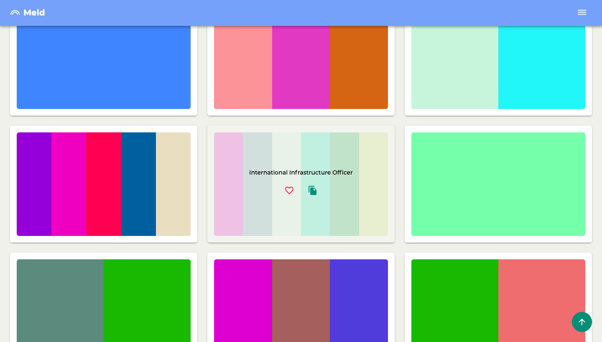
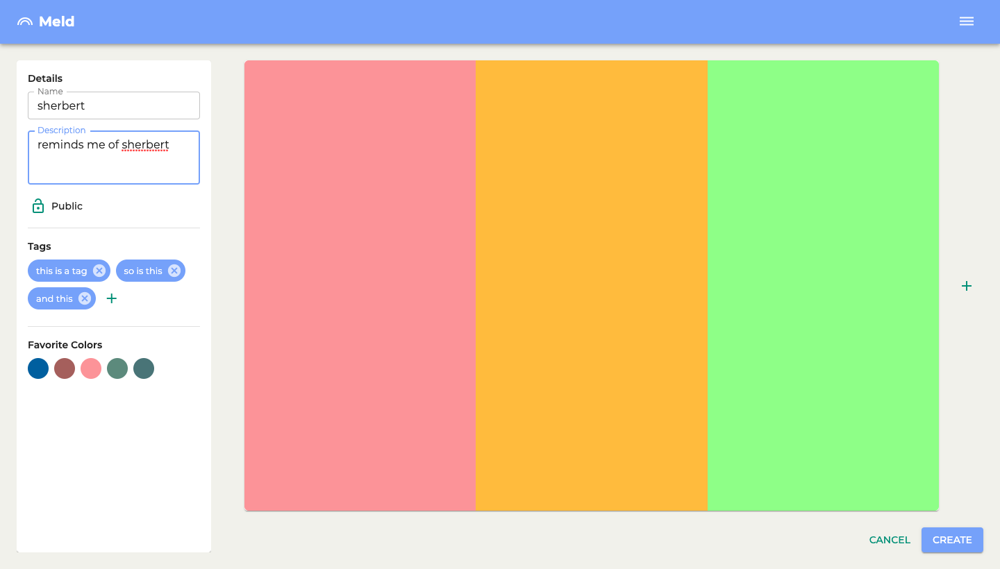
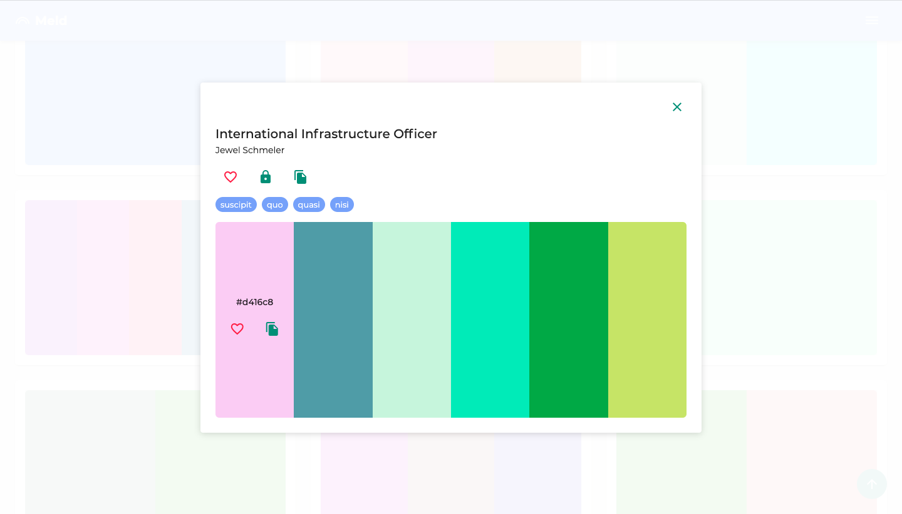

# MELD

A single-page frontend web application designed to make creating color themes and palettes easier. Built with React, Redux, and TypeScript.

## Project Status

This project is currently in development. Users can create new palettes, copy color and palette values, private a palette of their own, and favorite a palette or color. Functionality to edit a palette is in progress. I plan on using local storage to persist data, and integrate the Cooper Hewitt API to produce better mock data.

#### Future features:

- Improve accessibility
- Include mobile/React Native capabilities

## Project Screen Shots

## Installation and Setup

Clone down this repository. You will need `node` and `yarn` installed globally on your machine.

Installation:

`yarn install`

To Start Server:

`yarn start`

To Visit App:

`localhost:8080`

## Reflection

Project goals include using technologies learned up until this point and familiarizing myself with documentation for new features. I chose to configure my own `webpack.config.js` file to more fully understand the build process.
